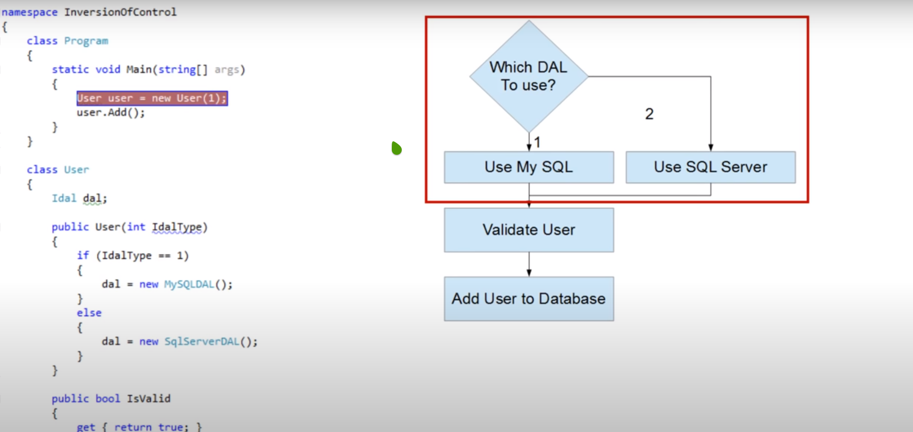

## What is Inversion of Control?
- The approach of outsourcing the construction and management of objects is called Inversion of Control.

## What is Dependency Injection?
- Dependency Injection is one form of (or one implementation of) Inversion of Control, but there are others. Dependency Injection is a design pattern which implements IOC principle.

## Difference between Dependency Injection(DI) and Inversion of Control(IOC)?
- Inversion of Control is a design principle whereas Dependency is one of the subtypes of the IOC principle.
- IOC is implemented by multiple design patterns like service locator,events,delegates and dependency injection whereas DI can be achieved by constructor,setter, field injections.

## Example of Dependency Injection

### Code
- Program.java

```java

package inversionofcontrol;

public class Program {

	public static void main(String[] args) {
	User user = new User(new MySQLDAL());
		user.Add();
	}
}
```

- User.java

```java
package inversionofcontrol;

public class User {
public User(Idal dalType) {
		dal = dalType;
	}
	public Boolean IsValid;

	public Boolean getIsValid() {
		return IsValid;
	}

	public void Add() { 
		if (IsValid) {
			dal.Add(this);
		}
	}
}
```

- Idal.java

```java
package inversionofcontrol;

public interface Idal {
	void Add(User user);
}
```

- MySQLDAL.java

```java
package inversionofcontrol;
public class MySQLDAL implements Idal {
	public void Add(User user) { // method used to add the user to database.
		// TODO Auto-generated method stub
		
	}
}
```

- SqlServerDAL.java

``` java
package inversionofcontrol;

public class SqlServerDAL implements Idal {

	@Override
	public void Add(User user) {
		// TODO Auto-generated method stub

	}

}
```

### Program Description
- This program creates a new User which will create its DAL(Data Access Layer), validate that the user is correct and use the DAL layer to add the user to the database.

### Without using Dependency Injection

```java
public class User {
Idal dal; 	// Using interface dal here
public User(int IdalType) { 
		if(IdalType == 1)
	{
		dal = new MySQLDAL();
	}
		else {;
			dal = new SqlServerDAL();
		}
	}
}
```

```java
package inversionofcontrol;

public class Program {
	public static void main(String[] args) {
		 // This int 1 creates a MySQLDAL
//		User user = new User(1);
user.Add();
	}
}
```



- Here the dal object references to different implementations according to the integer value received in main class.
- Here even if we modify our User class like this we can see we are still doing everything in our user class.
- The decision of which data access layer Type to use is where we begin to look at inversion of control
- Our User class is tightly coupled to our data access layer
- The User class is defining for itself, what type of DAL to use
- ** Most of the time programmers don't get to choose the DAL, they are handed one.**
We are going to modify the constructor to achieve IOC through Dependency Injection.

### After Utilizing Dependency Injection

```java
package inversionofcontrol;

public class User {
public User(Idal dalType) {
		dal = dalType;
	}
	public Boolean IsValid;

	public Boolean getIsValid() {
		return IsValid;
	}

	public void Add() { 
		if (IsValid) {
			dal.Add(this);
		}
	}
}
```

- DAL coming in through the constructor
- By doing this we have inverted the control, the User class is no longer controlling where its DAL is coming from.
- It knows that there is a DAL that it needs but where that comes from is entirely irrelevant.
- **The class no longer creates the DAL. It relies on something else to tell it what data access to use.**
- We have narrowed the focus of our User class.

```java
package inversionofcontrol;

public class Program {

	public static void main(String[] args) {
	User user = new User(new MySQLDAL());
		user.Add();
	}
}
```

- Here now we can see that our DAL is inverted. Originally, we were creating in the user now, its been switched so that something else is going to tell the User what DAL its going to use, this is inversion of control.
- The User class no longer creates the data access layer instead it relies on something else to tell it what data access layer to use.

## Features of IOC?

- Components can be easily tested independently.
- Program complexity can be reduced.
- You can switch components to another implementation.

## Drawbacks of IOC?

- Another framework in your toolbox (another mindset to adapt)
- Hard to figure out the flow in the application. As in, what is the actual implementation of the dependency you are looking at?
- Requires configuration of dependencies.

## Example of Service Locater which is one of the subtypes of IOC in Spring Boot

[GenericPasswordGeneratorService.java](https://github.com/WilcyWilson/PasswordGenerator-WebApp/blob/starting_up_1/src/main/java/com/noob/coder/PasswordGenerator/service/GenericPasswordGeneratorService.java)

- Here GenericPasswordGeneratorService class utilizes the @Service Annotation. We can see this GenericPasswordGeneratorService class implements IPasswordGeneratorService interface.

[GenericCheckAlgorithmService.java](https://github.com/WilcyWilson/PasswordGenerator-WebApp/blob/starting_up_1/src/main/java/com/noob/coder/PasswordGenerator/service/GenericCheckAlgorithmService.java)

- Now, In here we are using @Autowired annotation which searches for all the classes with @Service annotation that specifically implements GenericPasswordGeneratorService.
- Once it finds the @Service class then its like doing which is similar to dependency injection shown above:

```java
Idal dal = new MySQLDAL();
```

- @Autowiring annotation does this for us automatically like shown below:

```java
private IPasswordGeneratorService passwordService = new GenericCheckAlgorithmService"
```

- **This is all done through utilzing something called Java Reflection on Spring.**


#### References

https://www.youtube.com/watch?v=zmdWWujU8M4
https://softwareengineering.stackexchange.com/questions/131446/what-is-inversion-of-control-and-when-should-i-use-it
https://peterdaugaardrasmussen.com/2017/07/30/advantages-of-ioc-containers-and-why-we-use-them/


